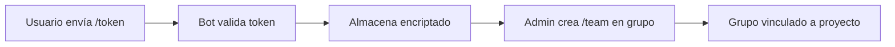
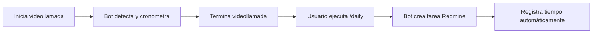

# 🤖 Redmine Telegram Bot

Bot de Telegram que integra grupos con proyectos de Redmine para gestión automatizada de dailies y registro de tiempo.

## 🚀 Características Principales

- **🔐 Gestión segura de tokens de Redmine** - Almacenamiento encriptado
- **👥 Vinculación grupo-proyecto** - Asocia grupos de Telegram con proyectos Redmine
- **🎥 Detección automática de videollamadas** - Rastrea duración automáticamente
- **⏰ Registro automático de tiempo** - Auto-loguea tiempo para usuarios configurados
- **📝 Creación de dailies** - Genera tareas en Redmine para reuniones
- **🛡️ Control de permisos** - Validaciones por tipo de chat y roles

## 📋 Comandos Disponibles

### 🔐 Chat Privado
| Comando | Descripción | Permisos |
|---------|-------------|----------|
| `/token TU_TOKEN` | Configurar token de Redmine API | Cualquier usuario |
| `/projects` | Listar proyectos de Redmine accesibles | Usuario con token |
| `/teams` | Mostrar equipos creados por el usuario | Cualquier usuario |

### 👥 Solo Grupos
| Comando | Descripción | Permisos |
|---------|-------------|----------|
| `/team ID NOMBRE` | Vincular grupo a proyecto Redmine | Admin del grupo + token |
| `/team_delete` | Desvincular grupo del proyecto | Admin + creador del equipo |
| `/daily @user1 @user2` | Registrar daily con participantes | Usuario con token |

### 🎥 Funciones Automáticas
- **Inicio videollamada** → Crea registro y cronómetro
- **Fin videollamada** → Calcula duración y da instrucciones
- **Detección participantes** → Identifica usuarios mencionados
- **Log automático** → Registra tiempo para usuarios con token

## 🛠️ Instalación y Configuración

### Prerrequisitos
- Python 3.11+
- Base de datos SQLite
- Token de bot de Telegram
- Acceso a API de Redmine

### Variables de Entorno
```bash
TELEGRAM_BOT_TOKEN=tu_token_del_bot
REDMINE_URL=https://tu-redmine.com
ENCRYPTION_KEY=tu_clave_de_encriptacion
DATABASE_URL=mine_bot.db
```

### Instalación
```bash
# Instalar dependencias
pip install -r requirements.txt

# Ejecutar migraciones (si las hay)
python migrate_username.py

# Iniciar el bot
python main.py
```

## 🏗️ Estructura del Proyecto

```
mine-bot/
├── main.py                 # Punto de entrada del bot
├── mine_bot.db            # Base de datos SQLite
├── requirements.txt       # Dependencias Python
├── app/
│   ├── config.py          # Configuración y variables
│   ├── database/          # Modelos y servicios de BD
│   │   ├── database.py    # Configuración SQLAlchemy
│   │   ├── models.py      # Modelos de datos
│   │   └── services.py    # Servicios de negocio
│   ├── handlers/          # Handlers de comandos
│   │   ├── handlers.py    # Configuración principal
│   │   ├── start_handler.py
│   │   ├── token_handler.py
│   │   ├── projects_handler.py
│   │   ├── team_handler.py
│   │   ├── teams_handler.py
│   │   ├── team_delete_handler.py
│   │   ├── daily_handler.py
│   │   └── videochat_handler.py
│   ├── services/          # Servicios externos
│   │   └── redmine_service.py
│   └── utils/             # Utilidades
│       └── crypto.py      # Encriptación
└── tests/                 # Tests unitarios
    ├── test_daily_handler.py
    ├── test_database.py
    ├── test_redmine.py
    └── ...
```

## 🔄 Flujo de Trabajo

### 1. Configuración Inicial


### 2. Daily Meeting


## 🛡️ Seguridad

### Encriptación
- **Tokens Redmine**: Encriptados con Fernet (cryptography)
- **Variables sensibles**: No hardcodeadas en código
- **Auto-eliminación**: Mensajes con tokens se borran automáticamente

### Validaciones
- **Permisos de admin**: Verificados antes de operaciones de grupo
- **Existencia de proyectos**: Validada contra API Redmine
- **Límites temporales**: 30 minutos máximo para registrar dailies
- **Tipos de chat**: Comandos restringidos por contexto

## 📊 Base de Datos

### Modelos Principales

**Users**
- `telegram_id`: ID único de Telegram
- `username`: Username de Telegram
- `redmine_token_encrypted`: Token encriptado
- `created_at`: Fecha de creación

**Teams**
- `telegram_group_id`: ID del grupo Telegram
- `redmine_project_id`: ID del proyecto Redmine
- `redmine_project_code`: Código del proyecto
- `team_name`: Nombre del equipo
- `created_by_user_id`: ID del creador

**Dailies**
- `team_id`: Referencia al equipo
- `start_time`: Inicio de la reunión
- `end_time`: Fin de la reunión
- `participants_ids`: Lista de participantes
- `registered_in_redmine`: Flag de registro

## 🧪 Testing

```bash
# Ejecutar tests específicos
python -m pytest test_database.py -v
python -m pytest test_redmine.py -v
python -m pytest test_daily_handler.py -v

# Ejecutar todos los tests
python -m pytest tests/ -v
```

## 📚 API Redmine

### Operaciones Soportadas
- **Autenticación**: Verificación de tokens
- **Proyectos**: Listado y validación
- **Tareas**: Creación de dailies
- **Tiempo**: Registro automático de horas

### Formato de Daily
```json
{
  "subject": "Daily - Equipo Frontend - 2024-01-15",
  "description": "Daily meeting registrada automáticamente desde Telegram",
  "project_id": 123,
  "tracker_id": 1,
  "status_id": 1
}
```

## 🔧 Mantenimiento

### Logs
El bot genera logs detallados para:
- Creación y actualización de usuarios
- Operaciones de equipos
- Registro de dailies
- Errores de conexión Redmine
- Eventos de videollamadas

### Monitoreo
- **Conexión Redmine**: Validada en cada operación
- **Estado de base de datos**: Verificado en startup
- **Errores de handlers**: Capturados y logueados

## 🚀 Roadmap

### Funciones Planificadas
- [ ] `/help` - Ayuda detallada por comandos
- [ ] `/tasks` - Listar tareas asignadas del usuario
- [ ] `/time_entries` - Ver entradas de tiempo registradas
- [ ] `/settings` - Configuración avanzada de usuario
- [ ] **Dashboard web** - Panel de administración
- [ ] **Notificaciones** - Recordatorios de dailies
- [ ] **Métricas** - Estadísticas de uso del bot

### Mejoras Técnicas
- [ ] **Cache Redis** - Para mejorar rendimiento
- [ ] **Rate limiting** - Prevenir spam
- [ ] **Webhooks** - Integración bidireccional con Redmine
- [ ] **Multi-tenant** - Soporte para múltiples instancias Redmine

## 📞 Soporte

### Troubleshooting Común

**❌ Token inválido**
- Verificar permisos en Redmine
- Comprobar que la API esté habilitada
- Regenerar token si es necesario

**❌ Proyecto no encontrado**
- Confirmar ID correcto con `/projects`
- Verificar acceso al proyecto en Redmine
- Comprobar estado del proyecto (activo)

**❌ No se puede crear equipo**
- Verificar que no exista vinculación previa
- Confirmar permisos de admin en grupo
- Validar token de Redmine configurado

**❌ Daily no se registra**
- Verificar límite de tiempo (30 min máximo)
- Confirmar que hay una videollamada previa
- Comprobar permisos en proyecto Redmine

---

*Desarrollado para optimizar la gestión de dailies y registro de tiempo entre Telegram y Redmine* 🚀
